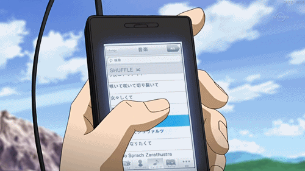
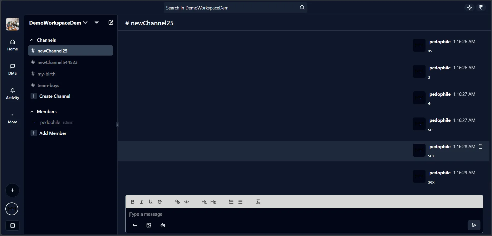
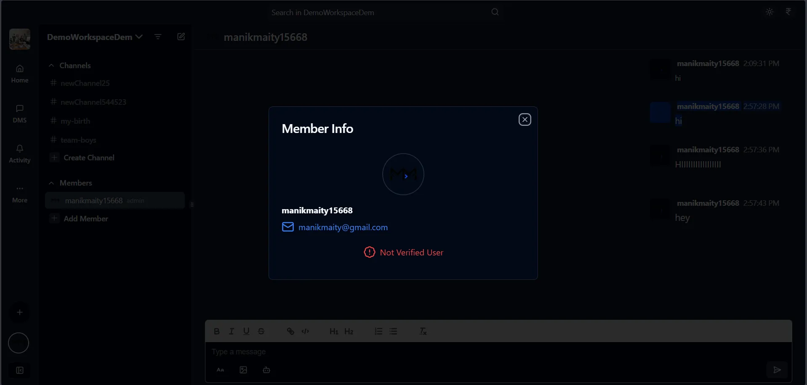
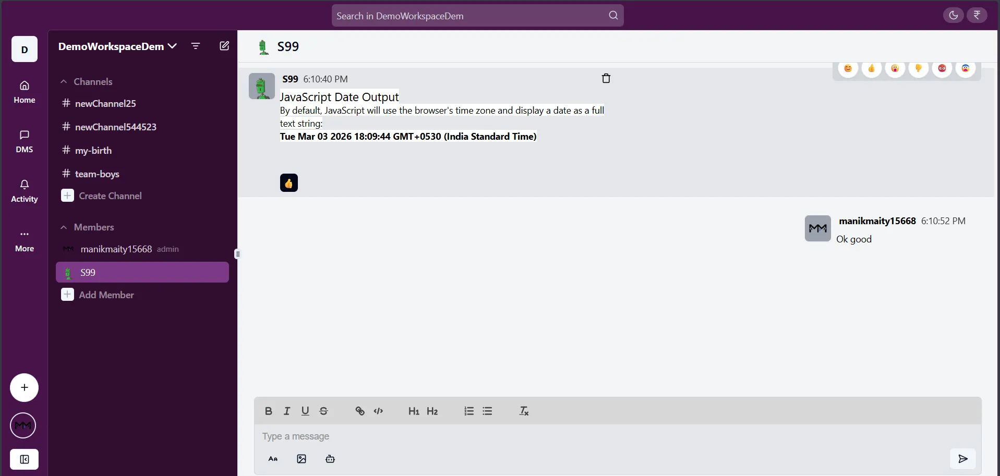
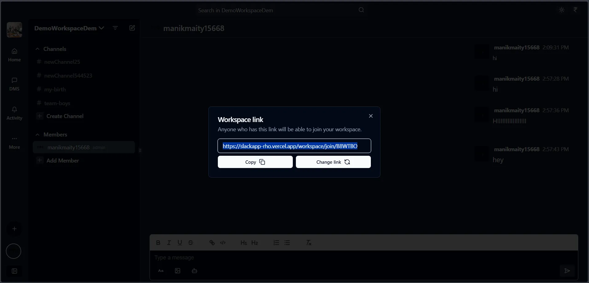
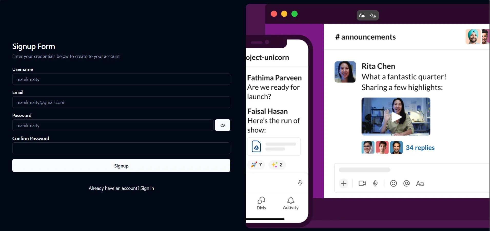
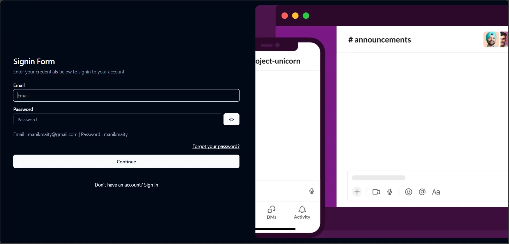
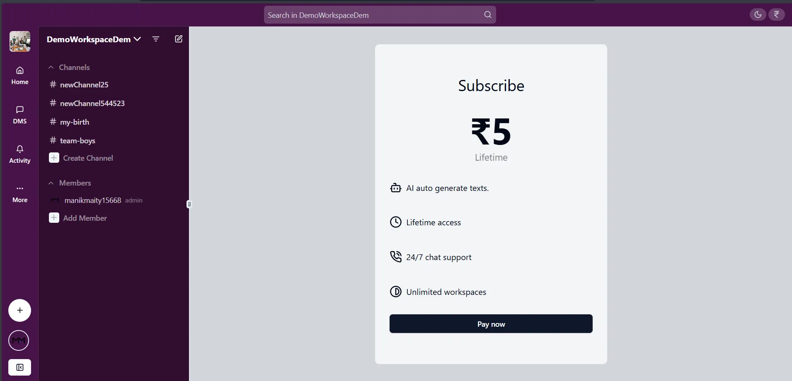

<div align="center">
    
    <h1>Chattr</h1>
</div>

A real-time Slack like collaborative platform for creating and managing workspaces, channels, and private messaging, with advanced admin controls and responsive design 🌐.

## 📚 Index

- [Features](#features)
- [Tech Stack](#tech-stack)
- [Live Link](#live-link)
- [Preview Images](#preview-images)
- [Installation and Setup](#installation-and-setup)

## Features

### 🔐 User Management

- Users can signup and login using their credentials with cookie-based authentication using JWT.
- Users can reset their password by requesting a password reset link via email.
- Users can update their username and verify their email in settings (verification link sent via email).
- Members can send private direct messages to other members.

### 🏢 Workspace and Channel Management

- Users can create and switch between multiple workspaces.
- Admins can update workspace details (name, image) and delete workspaces.
- Admins can invite members using a shareable and editable workspace link.
- Registered users can join a workspace via the shared link.
- Members and admins can leave any workspace.
- Admins can remove members or promote them to admin.
- Admins can create, rename, and delete channels within a workspace.
- Members can switch between channels in a workspace.
- Members can search workspace messagers.

### 💬 Messaging and Collaboration

- Messages are fetched and displayed for selected channels with real-time updates using WebSocket.
- Supports a rich-text input editor with features like bold, italic, underline, links, code, and bullets.
- Members can upload single images with messages.
- Members can react to messages and view reaction details.
- Messages can be deleted by the sender with real-time updates.
- Subcribed users can use AI text generator to generate messages.

### 🌟 Additional Features

- Integrated Razorpay for secure subscription payment processing.
- Supports dark mode and light mode switching.
- Designed with responsive UI using TailwindCSS and shadCN.

## Tech Stack

### 🎨 Frontend

- **UI Frameworks**: `shadCN`, `TailwindCSS`
- **APIs & Libraries**: `axios`, `firebase`, `razorpay`, `socket.io-client`, `groq`
- **Rich Text Editor**: `Quill`
- **Routing**: `react-router-dom`
- **State Management**: `react-query`

### 🖥️ Backend

- **Server Framework**: `Express`
- **Database & ORM**: `Mongoose`
- **Authentication**: `bcrypt`, `jsonwebtoken`
- **Real-Time Communication**: `Socket.io`
- **Payment Gateway**: `Razorpay`
- **Queue Management**: `Bull`, `ioredis`
- **Validation**: `Zod`
- **Email Service**: `Nodemailer`

## Live Link

- [Live Website](https://chattr.manikmaity.com/)
- [Backend Repository](https://github.com/ManikMaity/chattr-backend)

## Preview Images

### Channel



### Member



### Private Messaging



### Workspace Join



### Signup



### Signin



### Payment



## Installation and Setup

### ✅ Prerequisites

- Node.js and npm/yarn installed.
- MongoDB database set up locally or on a cloud provider.
- Radis server set up locally or or a cloud provider.
- Razorpay account for subscription payments

### 📝 Steps

0. Make a folder for the project and cd into it

   ```bash
   mkdir chattr
   cd chattr
   ```

1. **Clone the backend Repository:**
   ```bash
   git clone https://github.com/ManikMaity/chattr-backend.git
   cd chattr-backend
   ```
2. **Install dependencies:**
   ```bash
   npm install
   ```
3. **Create a `.env` file and add the following variables:**
   ```env
   PORT=3000
   NODE_ENV="development"
   DEV_DB_URL="your_dev_database_url"
   PROD_DB_URL="your_prod_database_url"
   SALT_ROUND=6
   JWT_SECRET="your_jwt_secret"
   MAIL_PASSWORD="your_mail_password"
   MAIL_ID="your_email_id"
   REDIS_HOST="your_redis_host"
   REDIS_PORT="your_redis_port"
   REDIS_PASSWORD="your_redis_password"
   CLIENT_URL="http://localhost:5173"
   RAZORPAY_ID="your_razorpay_id"
   RAZORPAY_SECRET="your_razorpay_secret"
   ENABLE_EMAIL_VERIFICATION=true
   JWT_EXPIRY="1y"
   GROQ_API=your_groq_api
   ```
4. **Start the backend server:**
   ```bash
   npm run dev
   ```
5. **Clone Frontend Repository:**
   ```bash
   cd ..
   git clone https://github.com/ManikMaity/chattr-frontend.git
   cd chattr-frontend
   ```
6. **Install dependencies:**
   ```bash
   npm install
   ```
7. **Create a `.env` file and add the following variables:**
   ```env
   VITE_BACKEND_URL="http://localhost:3000/"
   VITE_FRONTEND_URL = "http://localhost:5173"
   VITE_BACKEND_SOCKET_URL="http://localhost:3000"
   VITE_FIREBASE_API_KEY="your firebase api key"
   VITE_RAZORPAY_ID="your_razorpay_id"
   ```
8. **Start the frontend server:**
   ```bash
   npm run dev
   ```
9. Open your browser and navigate to `http://localhost:5173`
